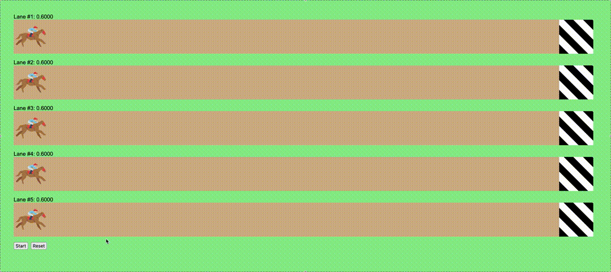

# Horse Race

This is a simple horse race I made in TypeScript and React.

By default, all of the horses have a 0.6 chance to move forward at every interval. After each interval, every horse has it's chance to move changed by a value between -0.1 and 0.1. This chance is visualized for each lane. The race can be paused and resumed at any time. The race can also be reset at any time, returning all the horses to their staring places and parameters.

## Future Improvements

- Randomize parameters for the horses.
- Introduce "risky" and "safe" horses that have more and less volatile changes in their chance to move forward.
- Add fanfare after the race finishes.

## How to run

In the project directory, run `npm install` then `npm start`.

Open [http://localhost:3000](http://localhost:3000) to view it in your browser.
