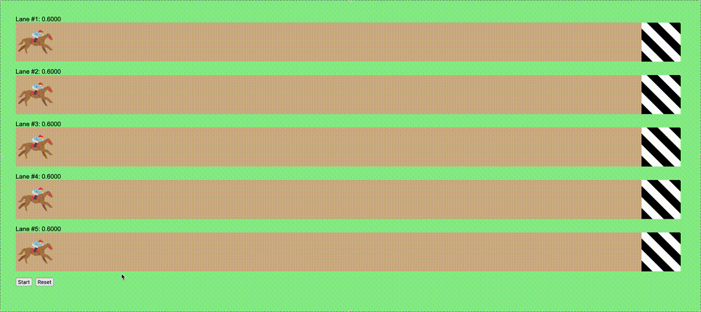

# Horse Race

This is a code demo of a horse race built with TypeScript and React.

By default, each horse has a 0.6 probability of moving forward at each interval. After every tick, the state updates and advances any horse that succeeds. Each horse’s movement probability is then adjusted by a random value between -0.1 and 0.1, and this changing probability is visualized for each lane throughout the race.

The race can be paused and resumed at any time, and it can also be reset to return everything to its initial state.

## Future Improvements

- Randomize horse parameters.
- Introduce “risky” and “safe” horses with higher and lower volatility in their chance of moving forward.
- Add a fanfare animation or sound effect when the race finishes.

## Live Demo

Visit the deployed app here:

https://horse-race-app-swart.vercel.app/
